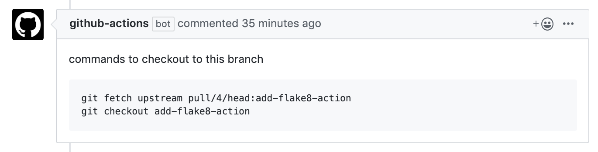

# Comment on PR

A GitHub action to add a comment on pull requests.

## To Use

1. Add a `uses` line to your GitHub workflow:
2. Pass a GitHub account's personal access token to the GITHUB_TOKEN environment variable.
3. Specify the path to a Markdown file to format the

```yml
- uses: Inventory-Shield/comment-on-pr@master
  env:
    GITHUB_TOKEN: ${{ secrets.CI_TOKEN }}
  with:
    filename: template.md
```

## Usage Example

[`.github/workflows/example.yml`](.github/workflows/example.yml)

```yml
name: Add checkout commands
on: pull_request
jobs:
  comment:
    name: Add checkout commands
    runs-on: ubuntu-latest
    steps:
      - uses: actions/checkout@master
      - uses: harupy/comment-on-pr@master
        env:
          GITHUB_TOKEN: ${{ secrets.CI_TOKEN }}
        with:
          filename: template.md
```

[`.github/workflows/template.md`](.github/workflows/template.md)

````markdown
commands to checkout to this branch

```
git fetch upstream pull/{pull_id}/head:{branch_name}
git checkout {branch_name}
```
````

The template above creates:


